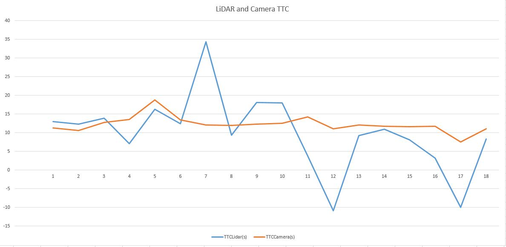
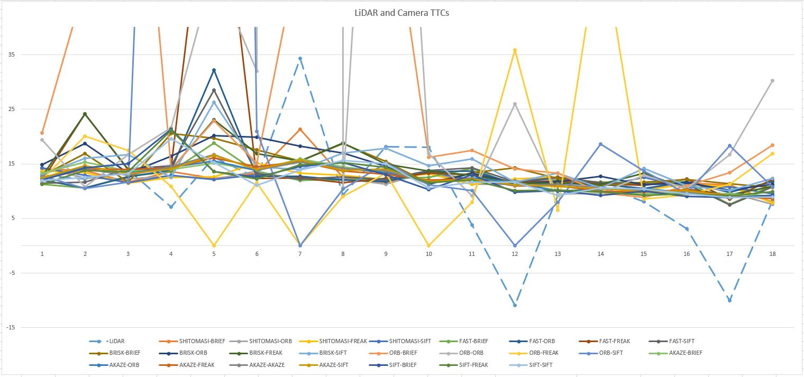

# 3D Object Tracking - Results Summary

## Project Specification

### FP.1 : Match 3D Objects
To match the bounding boxes across 2 frames, we visit each keypoint match, check if its previous and current keypoints are contained within their corresponding bounding boxes and store the bounding box ids corresponding to the matches which meet this criteria in a vector. 

Afterwards, the matched bboxes IDs pairs are sorted according to the number of repetitions.

Finally the sorted result is moved into a map type, so that each bounding box has one corresnponding entry, which recorded the maximum number of matches.

This logic is implemented inside the funcion matchBoundingBoxes().

### FP.2 : Compute Lidar-based TTC
To compute the LiDAR-based TTC, using the formula: 
TTC = d1 / (frameRate * (d0 - d1)),
we first cluster the point cloud of both: previous and current frames, to remove the effect of outlier points and only consider points which really belong to a cluster and hence to an object.

Clustering was performed by adapting the LiDAR code of the first project, through custom made k-d tree and eculudian clustering implementation.

This logic is implemented inside the functions computeTTCLidar(), getClusterPoints() and euclideanCluster().

### FP.3 : Associate Keypoint Correspondences with Bounding Boxes
As a preparation step to compute the Camera TTC, we loop over all keypoints matches and if the current keypoint is contained within the current bounding box, we associate these matches to the bounding box to be considered for TTC calculation.

This logic is implemented inside the function clusterKptMatchesWithROI().

Outlier matches is handled later in the next in the function computeTTCCamera() through using the median distance ratio instead of the mean, so that the outlier effect is excluded.

### FP.4 : Compute Camera-based TTC
Finally, the camera based TTC is calculated through looping over all keypoints matches that were associated with the given bounding box, and calculate the distance ratio between the keypoints of the current and previous frame. Afterwards we take the mean of all the distance ratios, to ommit the effect of the matches outliers, and calculate the camera TTC according to the formula:

TTC = -1 / (frameRate * (1 - medianDistRatio))

This logic is implemented inside the function computeTTCCamera().

### FP.5 : Performance Evaluation 1
For the purpose of performance evaluation, all values of interest were dumpted to a csv file: [results.csv](results.csv). Afterwards, an analysis was made using excel in [results.xlsx](results.xlsx).

For the purpose of analyzing the LiDAR TTC, we compare it against one of the good performing detector-descriptor pair which is FAST-BRIEF, as shown below:

Looking into the plot, there are 3 main events where the LiDAR TTC looks way off at frames 7, 12 and 17.
In frame 7, the TTC value increased from ~12 to ~34 seconds. This could be due to the effect of some outliers, which still pass the clustering criteria but are giving wrong estimates for the minimum distance, and accordingly for the TTC.
In frames 12 and 17, the value is negative, which means that the speed of the ego vehicle was instantaniously less than that of the target vehicle, so the distance slightly increased within this frame and accordingly the TTC result is negative (infinite).

### FP.6 : Performance Evaluation 2
To evaluate the performance of the camera based TTC of different detector descriptor pairs, the results of all pairs across different frames were plotted together with the LiDAR-based TTC as shown below:

The performance of the camera based TTC depends mainly on the detector performance and how many keypoints it provides. For example, the HARRIS detector reults were way off and were excluded from the plot. Also, as shown in the plot, some other detectors had outlier results in some frames due to the same reason, while still performing quite well in other scenes.

A good example of the detector-descriptor pair is the FAST-BRIEF combination, shown previously.
